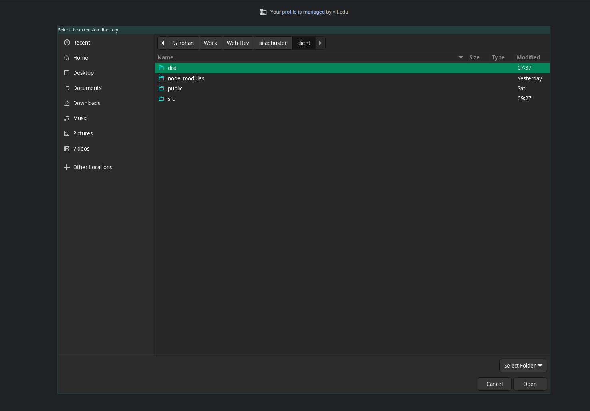

## Setup
Since the extension runs locally for now, here are the steps to set it up:  
1. Clone the repository: `git clone git@github.com:SamstyleGhost/AI-AdBuster.git`
2. Once in the root folder: `cd server && npm install`
3. Would also need to setup the environment variables `GROQ_API_KEY` for llama3-vision and `EDEN_API_KEY` for gpt-4o-mini and gemini-1.5-flash
4. Then, from the root directory `cd client && npm install && npm run dev`
5. Go to your Chrome extension settings, turn on the Developer mode on the top-right corner, click on *load_unpacked* on the left hand side of the screen and select the *dist* folder present in the client

6. Well, thats it! Fire up your browser and see it in action!

## Workings
The frontend is built using React & Vite, while the backend is a NodeJS server. It works differently from adblockers even though, at first glance, they feel like the same workings. Adblockers block known adengine scripts from rendering any DOM elements. But, to actually let the DOM be modified and then replacing them was the harder part.  

True to the theme here, I have integrated the ability to work with multiple LLMs. The server has three endpoints currently, one for each LLM. Llama works the most reliably but GPT has some pretty creative writing styles. User has the option to choose which model they would like to continue with. User also has 3 modes: Normal, Vampire and Exorcism. Normal would replace ad content with the description and render the element while trying to match the general theme of the website, Vampire renders in a grayscale manner, while Exorcism removes the ad completely.

## API Endpoints
All the endpoints below require only a `file_url` parameter which would contain the src of the image.
- `POST /api/groq` : Calls the Llama 3.2 11B Vision model
- `POST /api/openai` : Calls the GPT 4o mini model
- `POST /api/gemini` : Calls the Gemini 1.5 Flash model